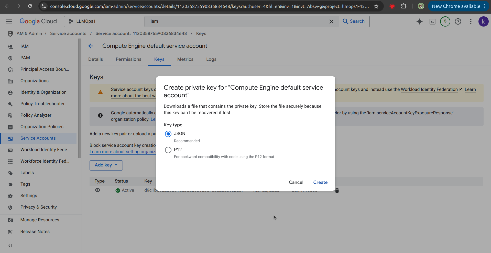
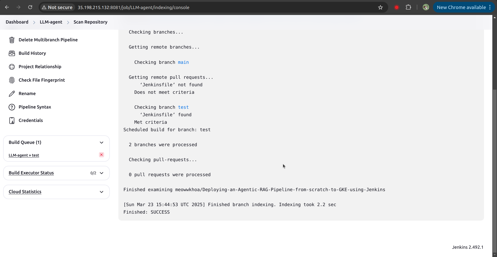

# **Deploying an Agentic RAG pipeline on K8s with Jenkins for answering Vietnamese Traffic Law questions** 
- [**Sections**](#deploying-agentic-rag-on-k8s-with-jenkins-for-answering-Vietnamese-traffic-law-questions)
  - [I. Introduction](#i-introduction)
  - [II. The Agentic RAG workflow architecture](#ii-the-agentic-rag-workflow-architecture)
  - [III. Create GKE Cluster using Terraform](#iii-create-gke-cluster-using-terraform)
  - [IV. Deploy services manually](#iv-deploy-serving-service-manually)
      - [1. Deploy NGINX ingress controller](#1-deploy-nginx-ingress-controller)
      - [2. Deploy the Embedding Model](#2-deploy-the-embedding-model)
      - [3. Deploy the Vector Database](#3-deploy-the-vector-database)
      - [4. Deploy the Context Retrieval component](#4-deploy-the-context-retrieval-component)
      - [5. Deploy the RAG agent](#5-deploy-the-rag-agent)
      - [6. Deploy the Primary agent](#6-deploy-the-primary-agent)
      - [7. Play around with the Application](#7-play-around-with-the-application)
  - [V. Deploy observable services](#v-deploy-observable-services)
      - [1. Tracing with Jaeger \& Opentelemetry](#1-tracing-with-jaeger--opentelemetry)
      - [2. Monitoring with Prometheus and Grafana](#2-monitoring-with-prometheus-and-grafana)
      - [3. Logging with Loki and Grafana](#3-logging-with-loki-and-grafana)
  - [VI. Create and setup a VM Instance for hosting Jenkins using Ansible](#vi-create-and-setup-a-vm-instance-for-hosting-jenkins-using-ansible)
  - [VII. Setup Jenkins](#vii-setup-jenkins)
      - [1 Connecting with K8s cluster](#1-connecting-with-k8s-cluster)
      - [2 Add Docker Hub's credentials](#2-add-docker-hubs-credentials)
      - [3 Config Github API usage rate limiting strategy](#3-config-github-api-usage-rate-limiting-strategy)
      - [4 Create Item and Connect Jenkins to GitHub](#4-create-item-and-connect-jenkins-to-github)
      - [5 Set Up a GitHub Webhook to Automatically Deploy on Code Push](#5-set-up-a-github-webhook-to-automatically-deploy-on-code-push)


## I. Introduction

### Motivation
In this project, I built an agentic RAG pipeline entirely from scratch, without using frameworks like LangChain or LlamaIndex. This approach allowed me to clearly understand the core concepts of RAG and agent design, as well as large language models (LLMs) and their integration with other components. My motivation was inspired by [Anthropic's post](https://www.anthropic.com/engineering/building-effective-agents) on building effective agents, which emphasizes the value of simple, modular designs over complex frameworks.


### Overview
Agentic retrieval-augmented generation (RAG) systems enhance traditional RAG by incorporating autonomous decision-making, allowing AI agents to iteratively refine queries, retrieve relevant information, and generate more accurate and context-aware responses. In this endeavor, I implemented a continuous Agentic RAG application on Google Kubernetes Engine (GKE) using CI/CD pipelines. This project marks a significant milestone in my journey as a Machine Learning Engineer (MLE), with foundational knowledge and skills acquired from [Full Stack Data Science](https://fullstackdatascience.com/), where I gained valuable experience in MLOps practices. 

The image below shows my overall high-level system architecture:


**Technology:**
* Source control: Git/Github
* CI/CD: Jenkins
* Build API: FastAPI
* Containerize application: Docker
* Container orchestration system: Kubernetes (K8s)
* K8s's package manager: Helm
* Data Storage for vector embedding: Weaviate
* Ingress controller: NGINX
* Observable tools: Prometheus, Loki, Grafana, Jaeger
* Deliver infrastructure as code: Ansible & Terraform
* Cloud platform: Google Cloud Platform (GCP)
* Serverless LLM inference: [RunPod](https://www.runpod.io/?inflect=&targetid=kwd-2285535193400&adgroupid=175137555098&loc_interest=&loc_physical=9214895&utm_source=adwords&utm_medium=ppc&utm_campaign=22174979174&utm_term=runpod+serverless&utm_content=730871123935&utm_gclid=CjwKCAjwnPS-BhBxEiwAZjMF0suVzcDS52JISL20WpRAaid7mMOCOSkmblfi2e_h6BZqMQJjqzefxBoCQCMQAvD_BwE&gad_source=1&gclid=CjwKCAjwnPS-BhBxEiwAZjMF0suVzcDS52JISL20WpRAaid7mMOCOSkmblfi2e_h6BZqMQJjqzefxBoCQCMQAvD_BwE) (for cost-efficient and scalable model hosting)


  
**Machine Learning Models:**
* Embedding model: [Vietnamese Embedding Model](https://huggingface.co/dangvantuan/vietnamese-embedding)
* LLM for Primary-agent: [Qwen/Qwen2.5-7B-Instruct](https://huggingface.co/Qwen/Qwen2.5-7B-Instruct)
* LLM for RAG-agent: [deepseek-ai/DeepSeek-R1-Distill-Qwen-7B](https://huggingface.co/deepseek-ai/DeepSeek-R1-Distill-Qwen-7B)

**Data Source:**
* Data Source: [Vietnamese Traffic Law Document (PDF)](https://congbao.chinhphu.vn/tai-ve-van-ban-so-08-vbhn-vpqh-40454-47126?format=pdf)

**Project Structure**
```txt
data-preparation/                                  /* Data preparation scripts */
├── data-indexing/                                 /* Data indexing pipeline */
│    └── notebook.ipynb
└── vectorizer/                                    /* Embedding module */
     ├── main.py
     ├── Dockerfile
     └── requirements.txt

agents/                                            /* Deployment of agents */
├── primary-agent/                                 /* Primary agent for orchestrating query resolution */
│    ├── main.py
│    ├── Dockerfile
│    ├── requirements.txt
│    └── docker-compose.yaml                       /* Docker Compose configuration for primary agent */
└── reasoning-agent/                               /* Reasoning agent for refining queries and generating responses */
     ├── main.py
     ├── Dockerfile
     ├── requirements.txt
     └── docker-compose.yaml                       /* Docker Compose configuration for reasoning agent */

context-retrieval/                                 /* Service for retrieving relevant context from Weaviate */
├── main.py
├── Dockerfile
└── requirements.txt

infra/                                             /* Infrastructure provisioning scripts */
├── ansible/                                       /* Ansible playbooks and configurations */
└── terraform/                                     /* Terraform scripts for cloud resources */

monitoring/                                        /* Monitoring and observability tools */
├── loki/                                          /* Loki for logging */
├── jaeger-all-in-one                              /* Jaeger for distributed tracing */
└── prometheus/                                    /* Prometheus (and Grafana) for monitoring */

deployments/                                       /* Deployment Helm charts */
├── weaviate/                                      /* Weaviate vector database deployment */
├── nginx-ingress/                                 /* Nginx Ingress Controller deployment */
└── your-application-helm-chart/                   /* Helm chart for deploying your application */

```

## II. The Agentic RAG workflow architecture

### Introduction
The Agentic RAG workflow is a digital assistant designed to address both general inquiries and specialized questions regarding Vietnamese Traffic Law. This system leverages LLM APIs in conjunction with a context retrieval component to generate precise and informed responses.

### Primary Agent architecture
Below diagram explains how my Primary agent works.

**Key points:**
* Decision Logic: The primary-agent intelligently decides if a query needs the RAG pipeline, ensuring efficient resource usage.
* Direct Answers: For simpler or general questions, the model responds without invoking additional retrieval.
* RAG Reasoning Agent: Complex or domain-specific queries—such as Vietnamese Traffic Law—are handled by the RAG agent.


### RAG Reasoning Agent architecture
Below diagram explains how my RAG agent works.

**Key points:**
* Context Integration: The agent receives an initial user query along with relevant context from the context retrieval component, ensuring responses are grounded in precise information.
* Iterative Refinement: If the retrieved context is insufficient or mismatched, the agent refines the query and requests new context, improving accuracy over multiple iterations.
* LLM-Powered Reasoning: A large language model (e.g., DeepSeek-R1-Distill-Qwen-7B) drives the reasoning process, leveraging its generative capabilities to produce more precise answers.


### Context Retrieval Component architecture
Below is a diagram illustrating how the Context Retrieval Component operates. Constructing this module from scratch provided me with valuable insights into the fundamental RAG workflow architecture.


## III. Create GKE Cluster using Terraform
**1. Create Project in [Google Cloud Platform](https://console.cloud.google.com/) and Enable GKE Standard in [GKE](https://console.cloud.google.com/kubernetes).**

**2. Install gcloud CLI & google-cloud-cli-gke-gcloud-auth-plugin**
It can be installed following this document https://cloud.google.com/sdk/docs/install#deb
```bash
gcloud auth application-default login
```
**3. Enables the Google Kubernetes Engine (GKE) API and sets the default project**
```bash
gcloud services enable container.googleapis.com --project=<your_project_id>
gcloud config set project <your_project_id>
```
**4. Using terraform to create GKE cluster**

Update <your_project_id> in terraform/variables.tf  and run the following commands to create GKE cluster:
```bash
cd infra/terraform
terraform init
terraform plan
terraform apply
```


+ GKE cluster is deployed at **asia-southeast1** with its one node machine type is: **"e2-standard-4"**  (4 vCPUs, 16 GB RAM and costs $396.51/month).
+ Unable [Autopilot](https://cloud.google.com/kubernetes-engine/docs/concepts/autopilot-overview) for the GKE cluster. When using Autopilot cluster, certain features of Standard GKE are not available, such as scraping node metrics from Prometheus service.

It can takes about 10 minutes for create successfully a GKE cluster. You can see that on [GKE UI](https://console.cloud.google.com/kubernetes/list)

**5. Connect to the GKE cluster**
+ In the [GKE UI](https://console.cloud.google.com/kubernetes/list), click on the cluster you want to connect and click `Connect`, then copy the command:


+ Then paste the command to the Terminal:


## IV. Deploy serving service manually
Use the [Helm chart](https://helm.sh/docs/topics/charts/) to deploy application on GKE cluster.
#### 1. Deploy NGINX ingress controller
Deploying NGINX on Kubernetes is a widely used approach for managing and directing traffic within a cluster, especially for external requests. Rather than assigning multiple external IPs to individual services, an NGINX ingress controller streamlines traffic routing, reduces costs, and simplifies your architecture. To deploy NGINX on Kubernetes, run the following bash command:
```bash
cd deployment

helm upgrade --install nginx-ingress ./nginx-ingress --namespace nginx-system --create-namespace
```
After executing this command, the NGINX ingress controller will be created in the nginx-system namespace. Then, copy the external-ip of its service to use in the following steps.


#### 2. Deploy the Embedding Model
Since my dataset is based on Vietnamese law, I utilize an embedding model specifically trained on Vietnamese vocabulary. To deploy this model on Kubernetes, run the following bash command:
```bash
cd deployment

helm upgrade --install text-vectorizer ./application-helm-chart/helm-embedding --namespace emb --create-namespace
```
After executing this command, a pod for the embedding model will be created in the `emb` namespace.

#### 3. Deploy the Vector Database
To deploy the vector database, run the following bash command:
```bash
cd deployment

helm upgrade --install   "weaviate"   ./weaviate   --namespace "weaviate"   --values ./weaviate/values.yaml --create-namespace
```
After this command, a pod for the vector database will be created in the `weaviate` namespace.


Now to index data - the PDF file to Weaviate, we follow these steps:
- Create the environment for indexing data to Weaviate:
  ```bash
  cd data-preparation/data-indexing

  conda create -n Data_Indexing_Pipeline python=3.9

  conda activate Data_Ingestion_Pipeline

  pip install -r requirements.txt
  ```
- Connect to Weaviate via port forward:
  ```bash
  kubens weaviate
  kubectl port-forward svc/weaviate 8085:85
  ```
  Now we can access Weaviate via `http://localhost:8085/`

- Run the Python notebook to finish the indexing process.


#### 4. Deploy the Context Retrieval component
To deploy the context retrieval component used in RAG, run the following bash command:
```bash
cd deployment

helm upgrade --install retrieval ./application-helm-chart/helm-context-retrieval --namespace context-retrieval --create-namespace
```
Now, a pod for the context retrieval service will be created in the `context-retrieval` namespace.

#### 5. Deploy the RAG agent
The following command is used to deploy the RAG reasoning agent:
```bash
cd deployment

helm upgrade --install rag-agent ./application-helm-chart/helm-rag-agent/ --namespace rag-agent --create-namespace
```
RAG agent is now running in the `rag-agent` namespace.

#### 6. Deploy the Primary agent
Primary agent service endpoint will be exposed to the Internet via NGINX service. Before running the Helm install command, we will edit the host of the ingress in `./Primary_agent/helm_primary_agent/values.yaml`, to use the `external-ip` of the NGINX service mentioned above and append `sslip.io` to expose the IP publicly. For example:
```helm
ingress: 
  host: 34.101.178.65.nip.io
```

Then, run the following bash command to deploy it on Kubernetes:
```bash
cd deployment

helm upgrade --install primary-agent ./application-helm-chart/helm-primary-agent/ --namespace primary-agent --create-namespace--create-namespace
```
Now you can access Primary agent at address: http://34.101.178.65.nip.io/docs


#### 7. Play around with the Application
+ The system will answer daily life question directly with the Qwen2.5 model, a non-reasoning model. As you can see in the below example, the system does not reason.


+ For questions that are related to Vietnamese Traffic Law, the Primary agent will call the RAG agent. RAG agent will "think" before answering the questions:

Another example:


+ Finally, if the RAG agent feels that the context retrieved is not appropriate to answer the question, then it will create a new refined query to do the RAG process again:


## V. Deploy observable services
#### 1. Tracing with Jaeger & Opentelemetry
Run the following command to deploy Jaeger on Kubernetes:
```bash
cd monitoring

helm upgrade --install jaeger-tracing ./jaeger-all-in-one --namespace jaeger-tracing --create-namespace
```

Now to access Jaeger, we will port forward:
```bash
kubectl port-forward svc/jaeger-tracing 16686:16686
```
Access Jaeger via `http://localhost:16686`:


Now we can trace how our components interact with each other for debugging purpose:


#### 2. Monitoring with Prometheus and Grafana
Prometheus scrapes metrics from Kubernetes.
Run the following command to deploy Prometheus on Kubernetes:
```bash
cd monitoring

helm upgrade --install prometheus-grafana-stack -f ./prometheus/values-prometheus.yaml ./prometheus/kube-prometheus-stack --namespace monitoring --create-namespace
```

Similar to Jaeger, edit `ingress.host=<your_domain_you_want>` and run the following command to add the domain name to NGINX's external IP. In my case:
```bash
sudo vim /etc/hosts

34.126.70.146 prometheus.bmk.com
34.126.70.146 grafana.bmk.com
```
Now you can access Prometheus UI and Grafana UI:

You should enter the username and password as shown in the image below: 


To display cluster metrics, navigate to `New/Import`:
Import dashboard `18283`

And this is the result:


#### 3. Logging with Loki and Grafana
To deploy Loki to K8s cluster, run the following command:
```bash
helm upgrade --install loki -f ./loki/values-loki.yaml ./loki/loki-stack --namespace monitoring --create-namespace
```
To view logs from Loki, from Grafana UI, head to `Home/Explore`, choose the namespace `primary-agent`:


Now we can see the logs from Primary agent:


## VI. Create and setup a VM Instance for hosting Jenkins using Ansible
You can use the same project with GKE as long as you have enough `quota`, or you can create a new project. In this guide, I used the same project as above. 

First, download the service account key in JSON format. From the GCP UI, head to `IAM & Admin/Service Accounts/Manage Keys`:

Then create a new JSON key file:


After obtaining the JSON key file, move it to the `ansible/secrets` folder and update the **service_account_file** and **project** variables in `ansible/playbooks/create_compute_instance.yaml`  corresponding with path secret file already and your project id, then run following command:
```bash
cd ansible

conda create -n ansible python==3.9 -y
pip install -r requirements.txt

ansible-playbook playbooks/create_compute_instance.yaml
```
+ VM instance is deployed at **asia-southeast1-b** with machine type is: **"e2-standard-2"**  (2 vCPUs, 8 GB RAM and costs $49.92/month).

After creating the instance, copy the external IP of the VM and add it to the inventory. 

Now, we have to update the SSH keys in the VM’s metadata. First create a RSA key pair, then paste the private key to the VM's metadata:


Now head to the GCP UI, paste the RSA key to the `Metadata` section of the VM instance.


To install Jenkins on the VM, use a Dockerfile from `custom_image_jenkins` to build a Docker-based Jenkins that comes with Helm, enabling it to create agents to deploy pods in Kubernetes:
```bash
cd custom_image_jenkins

docker build -t <your_name_dockerhub>:<your_tag> .
docker push <your_name_dockerhub>:<your_tag>
```
Alternatively, you can use my Docker image: `khoatomato/jenkins-k8s:v1`
Then, run the following command to install Jenkins on the VM:

```bash
cd ansible

ansible-playbook -i inventory playbooks/deploy_jenkins.yaml
```
After completing these tasks, SSH to the intance and check if Jenkins is working:


```bash
sudo docker logs jenkins
```
We can see that Jenkins is working:


## VII. Setup Jenkins
Now to access Jenkins, we need the password from the above step:


Then `Install suggested plugins`:


After the installation is complete, run the following commands:
```bash
kubectl create clusterrolebinding <your_name_space>-admin-binding \
  --clusterrole=admin \
  --serviceaccount=<your_name_space>:default \
  --namespace=<your_name_space>

kubectl create clusterrolebinding anonymous-admin-binding \
  --clusterrole=admin \
  --user=system:anonymous \
  --namespace=<your_name_space>
```
Install the following Kubernetes plugins in Jenkins: "Docker, Docker Pipeline, gcloud SDK, Kubernetes", as shown below:

Use the command `kubectl config view --raw` to view the cluster's certificate and URL.
#### 1 Connecting with K8s cluster
Create ClusterRoleBinding in you GKE instance:
```bash
kubectl create clusterrolebinding model-serving-admin-binding \
  --clusterrole=admin \
  --serviceaccount=default:default \
  --namespace=default

kubectl create clusterrolebinding anonymous-admin-binding \
  --clusterrole=admin \
  --user=system:anonymous \
  --namespace=default
```
Now head to `Manage Jenkins/Clouds/New Cloud`.
`Kubernetes URL` and `Kubernetes server certificate key` can be accessed via the command: `kubectl config view --raw`. 


#### 2 Add Docker Hub's credentials
To connect Jenkins with Dockerhub, create an access token on Dockerhub UI, then head to `Manage Jenkins/Credentials/System/Global credentials`:


Username will be your Dockerhub username, Password is the personal access token just created.


#### 3 Config Github API usage rate limiting strategy
Head to `Manage Jenkins/System` and change strategy into: `Never check rate limit`:


#### 4 Create Item and Connect Jenkins to GitHub
Create a `Multibranch Pipeline`


Now create a Github credential: username is your Github username, password is your Github personal access token:


Choose the Github credential just created, also paste the URL of your Github repository. You can see the connection:


Now Jenkins will scan the create the first build:



#### 5 Set Up a GitHub Webhook to Automatically Deploy on Code Push
Now to setup a Github webhook to automatically build code on Github, head to the repository `Setting`:


Our `Payload URL` will be the URL of Jenkins, also add `/github-webhook/`.

Choose `Pushes` and `Pull requests`.


Now the webhook is ready, pushes or pull requests will trigger builds.


Thank you for reading!!!